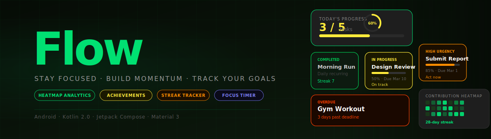
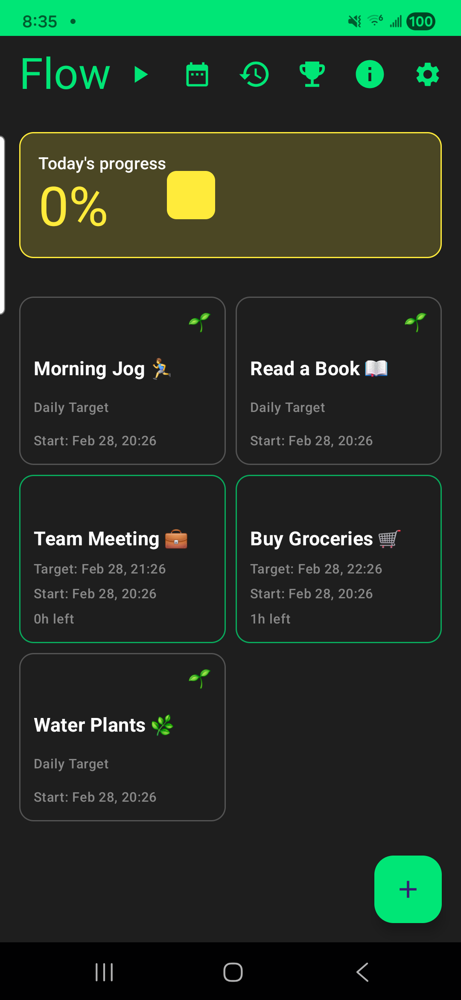
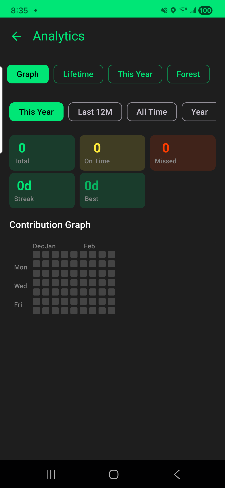
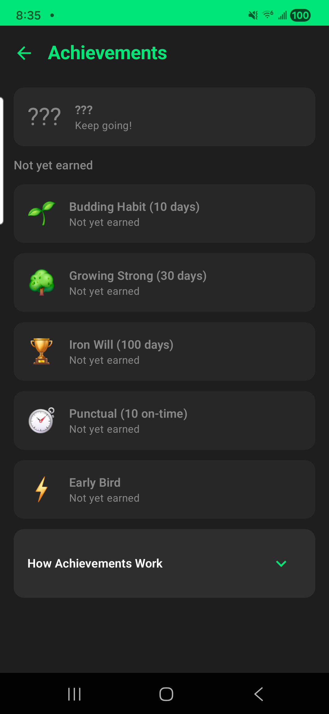
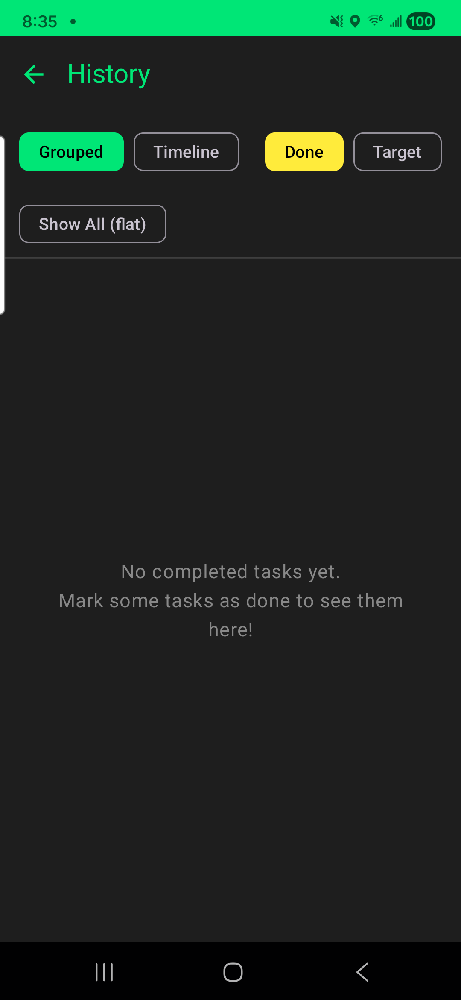

<div align="center">
  
</div>

<div align="center">

  [](https://developer.android.com)
  [](https://kotlinlang.org)
  [](https://developer.android.com/jetpack/compose)
  [](https://m3.material.io)
  [](LICENSE)

</div>

<br/>

**Flow** is a beautifully designed Android productivity app that turns your daily habits into momentum. Track tasks, visualize progress, build streaks, and unlock achievements — all in a sleek dark interface built for focus.

<br/>

---

## ✦ Features

<table>
  <tr>
    <td width="50%">
      <h3>🎯 Smart Task Management</h3>
      Organize tasks with urgency color coding. Green to orange to red — see what needs attention at a glance. Recurring tasks reset daily, keeping your habits effortless.
    </td>
    <td width="50%">
      <h3>📊 Contribution Heatmap</h3>
      A beautiful GitHub-style heatmap shows your completion history over days, weeks, months, and years. Watch the green fill in as you build momentum.
    </td>
  </tr>
  <tr>
    <td width="50%">
      <h3>🏆 Achievements & Badges</h3>
      Earn badges for streaks, early completions, and hidden milestones. Hidden surprise achievements keep things exciting — you'll discover them by staying consistent.
    </td>
    <td width="50%">
      <h3>🔥 Streak Tracking</h3>
      Every completed day extends your streak. The progress ring turns from yellow to neon green when you hit 100% — a satisfying visual reward for a great day.
    </td>
  </tr>
  <tr>
    <td width="50%">
      <h3>⏱ Focus Timer</h3>
      A built-in Pomodoro-style focus timer keeps you in the zone. Start a session, track time on task, and let Flow do the counting.
    </td>
    <td width="50%">
      <h3>📋 Completion History</h3>
      Every completed task is preserved with its exact timestamp. Browse and edit your history chronologically — nothing is ever lost.
    </td>
  </tr>
</table>

<br/>

---

## 📱 Screenshots

<br/>

<table>
  <tr>
    <td align="center" width="25%">
      
      <br/><br/>
      <sub><b>Home</b></sub><br/>
      <sub>Urgency-coded task grid · progress ring</sub>
    </td>
    <td align="center" width="25%">
      
      <br/><br/>
      <sub><b>Analytics</b></sub><br/>
      <sub>Contribution heatmap · streak counters</sub>
    </td>
    <td align="center" width="25%">
      
      <br/><br/>
      <sub><b>Achievements</b></sub><br/>
      <sub>Earned badges · locked goals · surprises</sub>
    </td>
    <td align="center" width="25%">
      
      <br/><br/>
      <sub><b>History</b></sub><br/>
      <sub>Full log grouped by date · editable</sub>
    </td>
  </tr>
</table>

<br/>

---

## 🎨 Design System

Flow uses a purposeful, minimal dark palette:

| Token | Colour | Meaning |
|-------|--------|---------|
| **Neon Green** | `#00E676` | Primary accent · Completed · On-track |
| **Yellow** | `#FFEB3B` | In Progress · Moderate urgency |
| **Orange** | `#FF8C00` | High urgency · Near deadline |
| **Red** | `#FF3D00` | Overdue |
| **Surface** | `#1E1E1E` | Card backgrounds |
| **Background** | `#121212` | App background |

<br/>

---

## 🛠 Tech Stack

| Layer | Technology |
|-------|------------|
| Language | Kotlin 2.0, JVM 11 |
| UI | Jetpack Compose · Material 3 |
| Architecture | MVVM · StateFlow · Hilt DI |
| Persistence | Room 2.6 · SQLite |
| Navigation | Navigation Compose 2.8 |
| Testing | JUnit 4 · MockK · Compose UI Test |
| Min SDK | API 26 (Android 8.0) |

<br/>

---

## 🚀 Getting Started

```bash
# Clone
git clone https://github.com/your-org/flow.git

# Open in Android Studio Ladybug or later
# Build & run on a device or emulator (API 26+)
./gradlew :app:assembleDebug
```

> **Requirements**: Android Studio Ladybug · JDK 17 · Android SDK 35

<br/>

---

## 📄 License

Released under the [MIT License](LICENSE).

<br/>

<div align="center">
  <sub>Built with ♥ using Kotlin & Jetpack Compose</sub>
</div>
